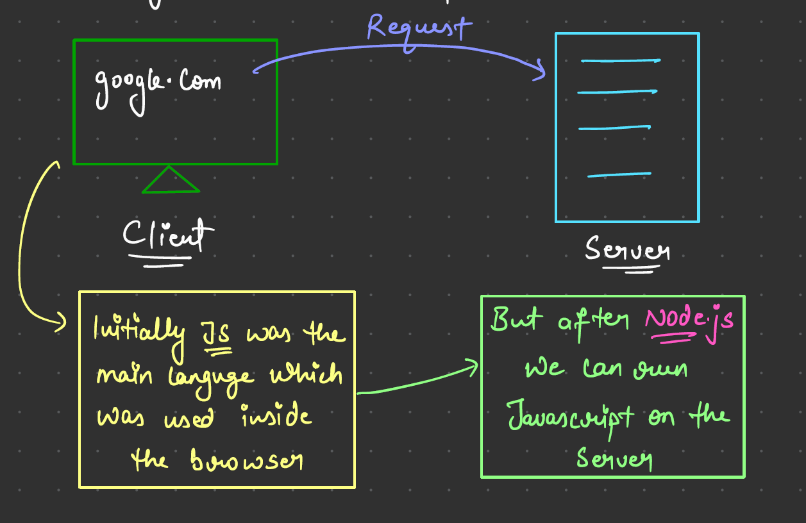
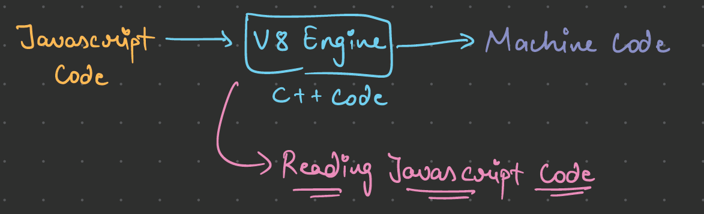

# Node JS - JS on Server

### What is a Server

- Server is nothing but a remote Computer / CPU

- With JavaScript come on Server, it gives us the opportunity to develop the Full Stack Application.

- Node JS is C++ Code

- Even V8 Engine is written in C++ Program

- V8 can be embedded into any C++ Application

- The job of V8 Engine is tp execute JS Code

- Node JS is a C++ Application with V8 embedded into it

